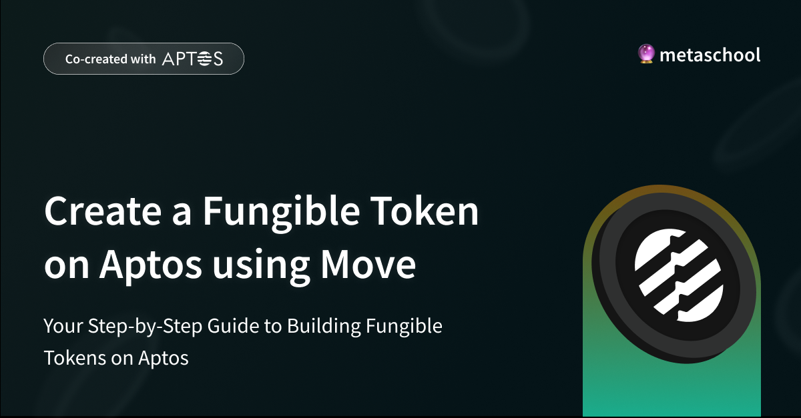

## 🧠 What is a Fungible Token?

A **Fungible Token (FT)** is a type of digital asset that is interchangeable with other tokens of the same type. Each unit of a fungible token has the same value and can be exchanged or traded with another unit without any difference.

### 🔍 Characteristics:
- **Interchangeable**: Each token is identical in value and function.
- **Divisible**: Can be divided into smaller units.
- **Uniform**: Each token has the same properties and value.

### 💡 Examples:
- Cryptocurrencies like Bitcoin, Ethereum, or Aptos Coin.
- Utility tokens used in games or platforms.

## 🛠️ Project Overview

This project demonstrates how to create a fungible token on the Aptos blockchain using the Move programming language. The token will have a name, symbol, and a specified number of decimal places. You will also learn how to mint (create) new tokens and transfer them between accounts.

## ✅ Prerequisites

- Basic programming knowledge (variables, functions, control flow).
- Understanding of blockchain concepts.
- Familiarity with the command line.

## 🚀 Step-by-Step Instructions

### Step 1: Install the Aptos CLI

```bash
curl -sSL https://aptos.dev/scripts/install_cli.sh | bash
